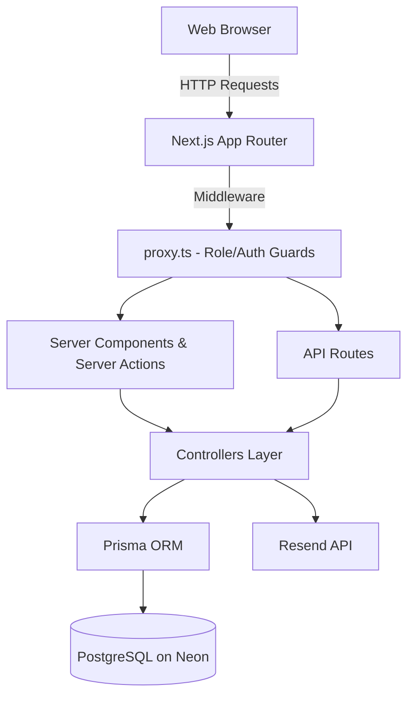

# TrackLancer


TrackLancer is a full-stack freelancer-client project management platform. Freelancers can create projects with milestone-based deliverables, share project codes with clients, and manage the full project lifecycle. Clients can accept projects, track progress, make UPI payments, and verify work.

## Key Features

- **Role-Based Access Control**: Separate flows and dashboards for FREELANCER and CLIENT.
- **Secure Authentication**: Email and password authentication with OTP verification powered by `better-auth` and Resend.
- **Project Lifecycle Management**: Create projects, share secure codes, client acceptance, and project tracking.
- **Milestone Tracking**: Deliverable-based progress tracking with position ordering and cascading delay management.
- **UPI Payment Flow**: Integrated UPI payment system with QR code generation and manual payment verification.
- **Budget Requests**: Freelancers can propose budget raises, which clients can review and approve/reject.
- **Mutual Cancellation**: Projects can only be cancelled with mutual consent from both parties.
- **Activity & Notifications**: Comprehensive activity logging (DELAYS, PAYMENTS, MILESTONES, REMINDERS, WARNINGS) with customizable notification preferences.
- **Rich Dashboards**: Revenue charts (monthly/weekly), earnings stats, and active/pending project metrics.
- **Automated Data Cleanup**: Cron jobs automatically clear stale activities and pending projects.

## Architecture Overview

TrackLancer is built on a modern Next.js 16 (App Router) architecture, utilizing Server and Client Components to balance SEO, performance, and interactivity. The backend logic is encapsulated within controllers that interact with a PostgreSQL database via Prisma ORM. 



## Folder Structure

```
track-lancer/
├── app/
│   ├── (auth)/              # Auth pages (login, register, forgot-password)
│   ├── (protected)/         # Role-guarded pages
│   │   ├── client/          # 13 client pages (dashboard, projects, payments, etc.)
│   │   └── freelancer/      # 13 freelancer pages (dashboard, milestones, projects, etc.)
│   ├── (public)/            # Public pages (terms)
│   ├── api/                 # API routes (auth, cron, profile, activity)
│   ├── components/          # Shared and role-specific UI components
│   ├── dashboard/           # Role-based redirect router
│   ├── lib/                 # Core business logic
│   │   ├── actions/         # Next.js Server Actions
│   │   ├── Batch-Fetch/     # Aggregated data fetchers for dashboards
│   │   ├── controllers/     # Controller layer for business logic
│   │   └── validations/     # Zod validation schemas
│   └── unauthorized/        # 403 Forbidden page
├── docs/                    # Extensive project documentation
├── prisma/                  # Prisma schema, migrations, and seed scripts
└── types/                   # TypeScript definitions
```

## Environment Variables

Create a `.env` file in the root directory and populate it with the following required variables:

| Variable | Description | Required |
|---|---|---|
| `DATABASE_URL` | PostgreSQL connection string (Neon recommended) | Yes |
| `BETTER_AUTH_SECRET` | Secret key for better-auth session encryption | Yes |
| `BETTER_AUTH_URL` | Base URL of the application (e.g., http://localhost:3000) | Yes |
| `BETTER_AUTH_TRUSTED_ORIGINS` | Comma-separated allowed origins (e.g., http://localhost:3000) | No |
| `RESEND_API_KEY` | API key for the Resend email service | Yes |
| `RESEND_FROM_EMAIL` | Sender email address (default: onboarding@resend.dev) | No |
| `CRON_SECRET` | Bearer token for authenticating the cleanup cron endpoint | Yes |

## Installation & Running Locally

1. **Clone the repository:**
   ```bash
   git clone <repository-url>
   cd track-lancer
   ```

2. **Install dependencies:**
   ```bash
   npm install
   ```

3. **Set up the database:**
   Ensure your `.env` is configured properly.
   ```bash
   npx prisma generate
   npx prisma migrate dev
   ```

4. **Seed the database (Optional):**
   Populates the database with demo users (freelancers, clients) and sample projects.
   ```bash
   npm run seed
   ```

5. **Start the development server:**
   ```bash
   npm run dev
   ```
   The application will be accessible at `http://localhost:3000`.

## Production Build & Deployment

1. **Build the application:**
   ```bash
   npm run build
   ```

2. **Start the production server:**
   ```bash
   npm start
   ```

3. **Deployment**: TrackLancer is designed to be easily deployed on Vercel. Ensure all environment variables are added to your hosting provider's configuration.

## Available Scripts

- `npm run dev` - Starts the Next.js development server (accessible via LAN).
- `npm run build` - Builds the application for production.
- `npm start` - Starts the production server.
- `npm run lint` - Runs ESLint.
- `npm run seed` - Runs the Prisma database seeder.

## Documentation

For more detailed technical documentation, refer to the `docs/` directory:
- [Architecture (docs/ARCHITECTURE.md)](docs/ARCHITECTURE.md)
- [API Reference (docs/API.md)](docs/API.md)
- [Database Schema (docs/DATABASE.md)](docs/DATABASE.md)
- [Authentication Flow (docs/AUTHENTICATION.md)](docs/AUTHENTICATION.md)
- [Application Workflows (docs/FLOW.md)](docs/FLOW.md)
- [Deployment Guide (docs/DEPLOYMENT.md)](docs/DEPLOYMENT.md)
- [Development Guide (docs/DEVELOPMENT.md)](docs/DEVELOPMENT.md)
- [Performance Strategies (docs/PERFORMANCE.md)](docs/PERFORMANCE.md)
- [Security Practices (docs/SECURITY.md)](docs/SECURITY.md)

## License

Proprietary — Copyright 2026 narendra-create. All rights reserved.
