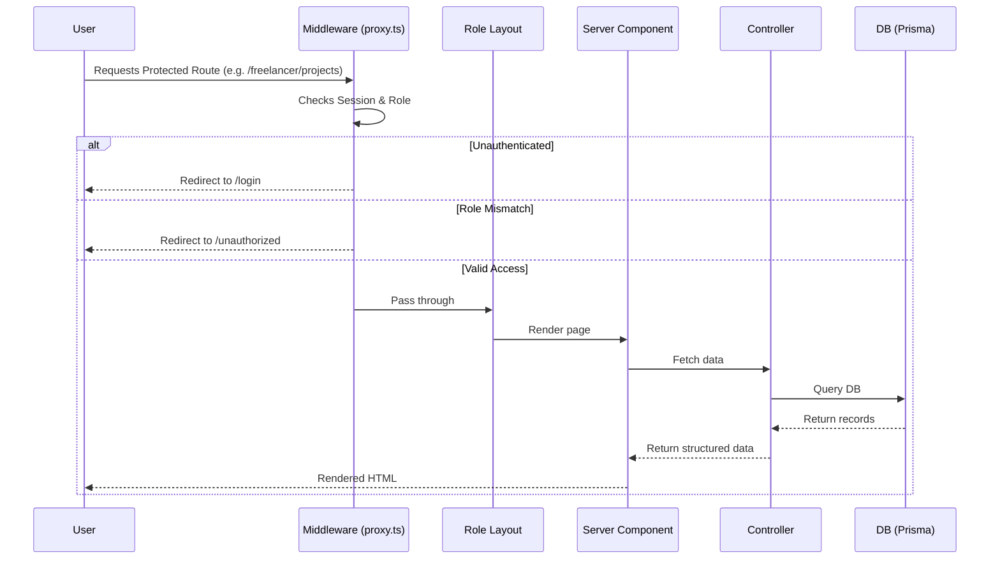

# MileGlide Architecture

MileGlide utilizes a modern, layered architecture built on top of **Next.js 16 (App Router)**. This document provides a high-level overview of the system's design, request lifecycle, data flow, and key architectural decisions.

## High-Level Architecture

The application is structured into clearly defined layers to separate concerns, improve maintainability, and ensure security.

1. **Presentation Layer**: Next.js React components (both Server and Client components). Heavily utilizes Tailwind CSS for styling and Framer Motion for animations.
2. **Routing Layer**: Next.js App Router utilizes Route Groups to cleanly separate public `(public)`, authentication `(auth)`, and role-guarded `(protected)` pages.
3. **Middleware Layer**: `proxy.ts` acts as the gatekeeper, handling session validation and role-based route guarding.
4. **API Layer**: Next.js Route Handlers (`app/api/`) expose essential endpoints for cron jobs, activity polling, and third-party webhooks/integrations.
5. **Controller Layer**: Core business logic is abstracted into dedicated controller files within `app/lib/controllers/`, keeping routes and actions thin.
6. **Server Actions**: `app/lib/actions/` contains Next.js Server Actions used primarily by client components for form submissions and mutations.
7. **Validation Layer**: Zod schemas (`app/lib/validations/`) strictly validate all incoming data across API routes and Server Actions.
8. **Data Access Layer**: Prisma ORM provides a type-safe interface to the PostgreSQL database (hosted on Neon).
9. **Auth Layer**: `better-auth` handles secure session management, paired with the `emailOTP` plugin and Resend for passwordless-style email verification.
10. **Batch Fetch Layer**: Dedicated services (`FreelancerDashboardStats`, `ClientDashboardStats`) use `Promise.all` to aggregate complex dashboard data efficiently.

## Request Lifecycle

The lifecycle of a typical request through MileGlide:

## Data Flow

- **Server Components** fetch data securely by invoking `getSession()` (cached per request) and directly calling methods from the Controller Layer, which queries Prisma.
- **Client Components** mutate data by invoking Server Actions. Server Actions validate the input using Zod, then delegate the execution to the Controller Layer.
- **Real-time Updates (Polling)**: Client components use SWR to poll `GET /api/activity` for new notifications, decoupling activity logs from heavy page reloads.

## Folder Responsibilities

- **`app/(auth)`**: Public-facing authentication pages. Handled seamlessly by `better-auth`.
- **`app/(protected)`**: The core application, strictly split into `/client` and `/freelancer` subdirectories. Role mismatches are caught by middleware.
- **`app/api`**: Exposes necessary REST-like endpoints. Notably, the `/api/cron/cleanup` route is secured via a bearer token for automated maintenance.
- **`app/lib/controllers/`**: The heart of the application logic. 
  - `ProjectController.ts`: Massive controller handling the entire project lifecycle.
  - `milestoneController.ts`: Handles deliverable tracking and cascading delays.
  - `paymentController.ts`: Manages UPI payment verifications.
- **`app/lib/validations/`**: Zod schemas act as the single source of truth for data integrity.

## Design Decisions

1. **Cursor-Based Pagination**: Opted over offset-based pagination to provide reliable, scalable reads (especially critical for infinite scrolling in activity feeds and project lists).
2. **Server Actions for Mutations**: Leverages Next.js 14+ capabilities to avoid building boilerplate REST APIs for standard CRUD forms.
3. **Controller Pattern**: Abstracting logic away from Next.js specific files (like `page.tsx` or Server Actions) into pure TypeScript controllers makes the business logic easier to test and potentially reusable outside of the Next.js context.
4. **Activity Notifications via DB Polling**: Instead of maintaining stateful WebSockets, the app uses SWR to poll a dedicated activity table. This significantly reduces infrastructure complexity while providing a near-real-time feel.
5. **Manual UPI Verification**: Trust-based manual verification eliminates the need for complex payment gateway integrations, fitting the freelancer-client direct payment model in India.
6. **Mutual Project Cancellation**: Prevents unilateral abuse. Both the client and the freelancer must explicitly approve a cancellation request before a project is terminated.
7. **Cascading Milestone Delays**: Adjusting the deadline of a currently active milestone automatically shifts the deadlines of subsequent milestones if they overlap, reducing manual calendar management for freelancers.

## Scalability & Trade-offs

### Scalability Considerations
- Heavy reliance on **database indexes** across all frequently queried columns (e.g., status, role IDs, created dates).
- Use of **Prisma transactions** guarantees atomicity for complex operations like milestone promotion or project cancellation.
- React's `cache()` prevents redundant session database lookups during a single server render cycle.
- Database growth is bounded by automated **cron jobs** that prune old notifications and stale pending projects.

### Known Trade-offs
- **Polling vs. WebSockets**: SWR polling increases server request volume. While fine for a moderate user base, scaling to thousands of concurrent users might require a transition to Server-Sent Events (SSE) or WebSockets.
- **No Caching Layer (Redis)**: Every query currently hits PostgreSQL. High-traffic reads (like dashboard stats) may eventually necessitate a caching layer.
- **Test Coverage**: The absence of an automated test suite poses a regression risk. Business logic within controllers should ideally be unit tested.
