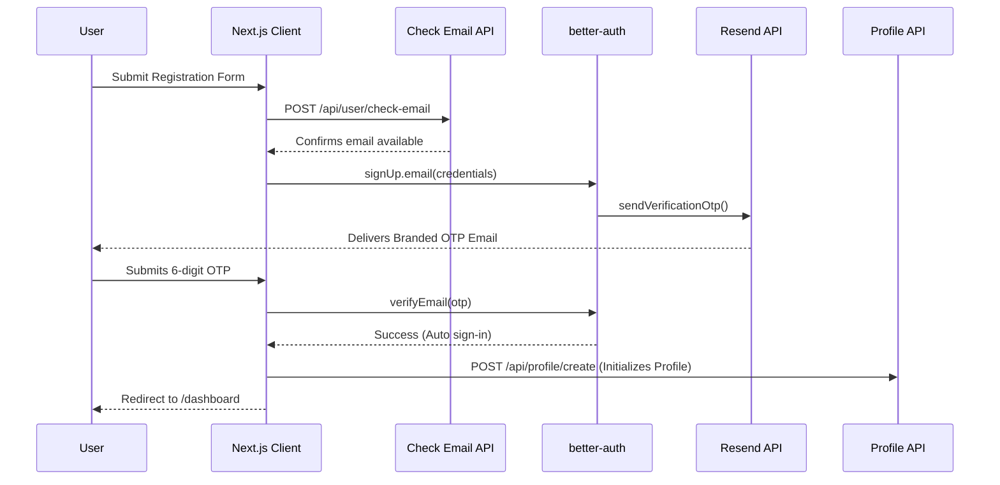

# Authentication & Authorization

MileGlide implements a secure, passwordless-style authentication system using `better-auth` combined with Resend for Email OTP delivery.

## Authentication System (better-auth)

The authentication system is configured in `auth.ts` using the Prisma adapter (PostgreSQL).

### Configuration Details
- **Provider**: Email & Password (enabled).
- **Verification**: Strict email verification required. Auto sign-in is enabled post-verification.
- **Custom User Fields**: Injects a strictly required `role` string field (defaults to `CLIENT`) into the core User object.
- **OTP Plugin**: Uses the `emailOTP` plugin with a 10-minute expiry, a maximum of 5 attempts, and securely hashed OTP storage in the database.
- **CORS/Origins**: Configured via `BETTER_AUTH_TRUSTED_ORIGINS` to allow secure cross-origin requests in localized deployments.

## Registration Flow

## Email Templates

All OTP emails are sent using visually branded HTML templates defined in `app/lib/email-templates.ts`. The templates utilize MileGlide's dark theme (#0f0f0f) and gold accents (#c8a96e) to maintain brand consistency throughout the onboarding process.

## Authorization & Middleware

Authorization is enforced at two distinct layers: Edge Middleware and Controller execution.

### Middleware Guard (`proxy.ts`)
The `proxy.ts` middleware runs on the Edge runtime and intercepts requests to protected routes (`/dashboard/*`, `/freelancer/*`, `/client/*`, `/login`, `/register`).

- **Unauthenticated**: Redirects to `/login`.
- **Role Mismatch**: If a user with role `CLIENT` attempts to access a `/freelancer/*` route (or vice versa), they are immediately redirected to `/unauthorized`.
- **Authenticated Access to Auth Pages**: Redirects users trying to hit `/login` back to their respective `/dashboard`.

### Controller Guard (`requireRole`)
Deep within the business logic (Controllers and Server Actions), the `requireRole(...roles)` utility (`app/lib/require-role.ts`) provides a secondary layer of defense.

It extracts the active session and performs a case-insensitive validation against the allowed roles array. It halts execution and returns consistent HTTP error statuses (`401 Unauthorized` or `403 Forbidden`) if constraints are violated.

## Session Management

Sessions are persisted in the PostgreSQL database.
- `getSession()` (in `lib/session.ts`) utilizes React's `cache()` to deduplicate database lookups across Server Components during a single render cycle.
- Sessions aggressively track `ipAddress` and parse the `userAgent` (via `ua-parser-js`).
- Users have full visibility into their active sessions via the Settings page and can remotely revoke rogue sessions using the `revokeSession(sessionId)` server action.
