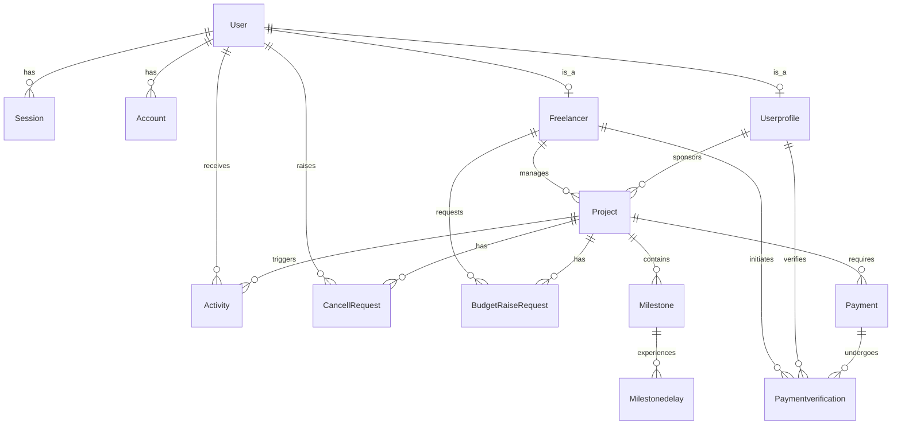

# MileGlide Database Architecture

MileGlide utilizes PostgreSQL as its primary datastore, interfaced via Prisma ORM. The schema consists of 13 models supporting authentication, project management, financial tracking, and activity logging.

## Entity-Relationship Diagram

## Models Overview

### 1. Core User & Auth Models (better-auth)
- **`User` (mapped: `user`)**: Core identity record. Tracks email verification, global role (`FREELANCER` or `CLIENT`), and notification preferences (`blockedNotificationTypes`).
- **`Session` (mapped: `session`)**: Active authentication sessions. Tracks `ipAddress` and `userAgent` for security monitoring.
- **`Account` (mapped: `account`)**: OAuth or password credential storage managed by better-auth.
- **`Verification` (mapped: `verification`)**: Temporary storage for OTPs and verification flows.

### 2. Role Profiles
- **`Freelancer`**: Extension of `User` for freelancers. Stores `category` (skills), contact info, and highly sensitive UPI payment details (`upiId`, `AccountHolderName`).
- **`Userprofile`**: Extension of `User` for clients. Stores contact phone numbers.

### 3. Project Management
- **`Project`**: The central entity linking a Freelancer and a Client. Tracks the `agreedCost`, global `deadline`, status, and unique 8-character sharing `projectcode`. 
- **`Milestone`**: Deliverables within a project. Enforces a strict chronological `position` and tracks granular statuses (`NOT_STARTED`, `IN_PROGRESS`, `COMPLETED`).
- **`Milestonedelay`**: Audit log of milestone deadline extensions, capturing both `oldDeadline` and `newDeadline`.

### 4. Financials
- **`Payment`**: Represents the total financial obligation for a project. Continuously updated as milestones complete (`total_cost` increments).
- **`Paymentverification`**: Represents individual, manual UPI transaction claims. Links a specific `txn_number` to a `Payment`, pending freelancer approval.
- **`BudgetRaiseRequest`**: Proposed increases to a project's `agreedCost` by a freelancer, requiring client approval.

### 5. Utilities
- **`Activity`**: System-generated notifications (e.g., delays, payments, reminders) tied to users and projects. Pruned automatically after 7 days.
- **`CancellRequest`**: Handles mutual-consent project termination. Tracks separate boolean flags (`freelancerApproved`, `clientApproved`).

## Enums

1. **`Categorys`**: Freelancer skills (`WEB_DEV`, `VIDEO_EDITOR`, `GRAPHIC_DESIGNER`, `WEB_DESIGNER`, `SEO`).
2. **`Milestonestatus`**: Deliverable states (`COMPLETED`, `NOT_STARTED`, `IN_PROGRESS`, `STOPPED`).
3. **`Paymentstatus`**: Financial states (`DUE`, `PAID`).
4. **`userrole`**: System roles (`FREELANCER`, `CLIENT`).
5. **`Projectstatus`**: Project lifecycle states (`COMPLETED`, `ACTIVE`, `PENDING`, `STOPPED`, `CANCELLED`).
6. **`BudgetRequestStatus`**: Request states (`PENDING`, `APPROVED`, `REJECTED`).
7. **`VerificationStatus`**: UPI transaction states (`VERIFIED`, `PENDING_VERIFICATION`, `REJECTED`).
8. **`ActivityType`**: Notification categories (`DELAY`, `PAYMENT`, `MILESTONEDONE`, `REMINDER`, `WARNING`).

## Indexing Strategy

MileGlide heavily utilizes composite and foreign-key indexes to optimize read-heavy dashboard aggregations:
- `Paymentverification` is indexed on `[txn_number, freelancerId, clientId]` to accelerate verification lookups.
- `Activity` is indexed on `[userId, createdAt, projectId, type]` to support high-performance cursor-based polling via SWR.
- Foreign keys (`userId`, `projectId`, `clientId`, `freelancerId`) are uniformly indexed across the schema to optimize relational joins.
