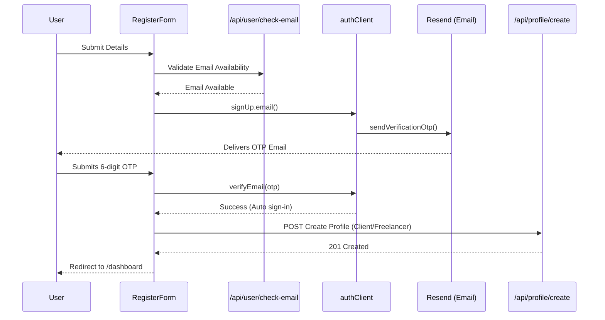
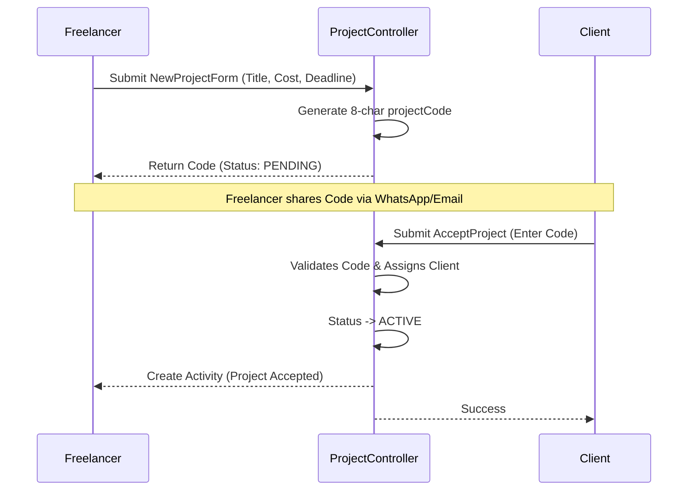
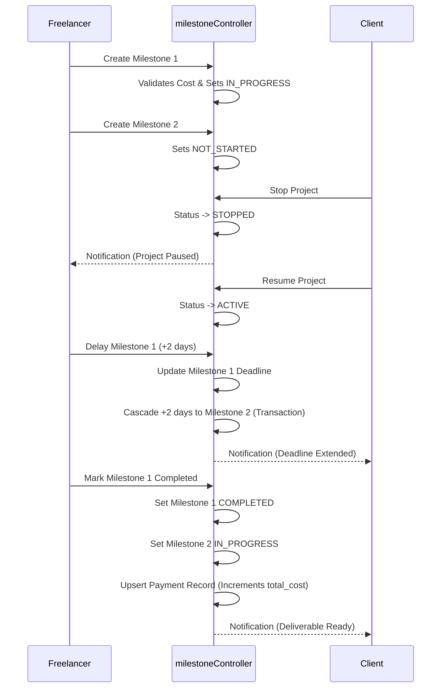
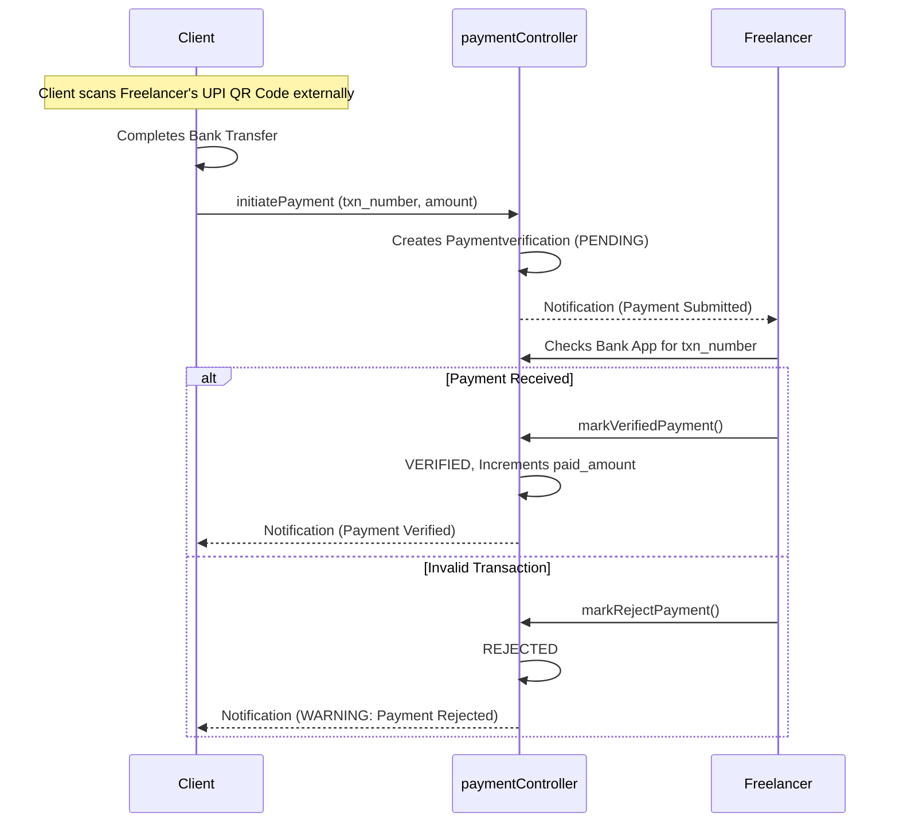
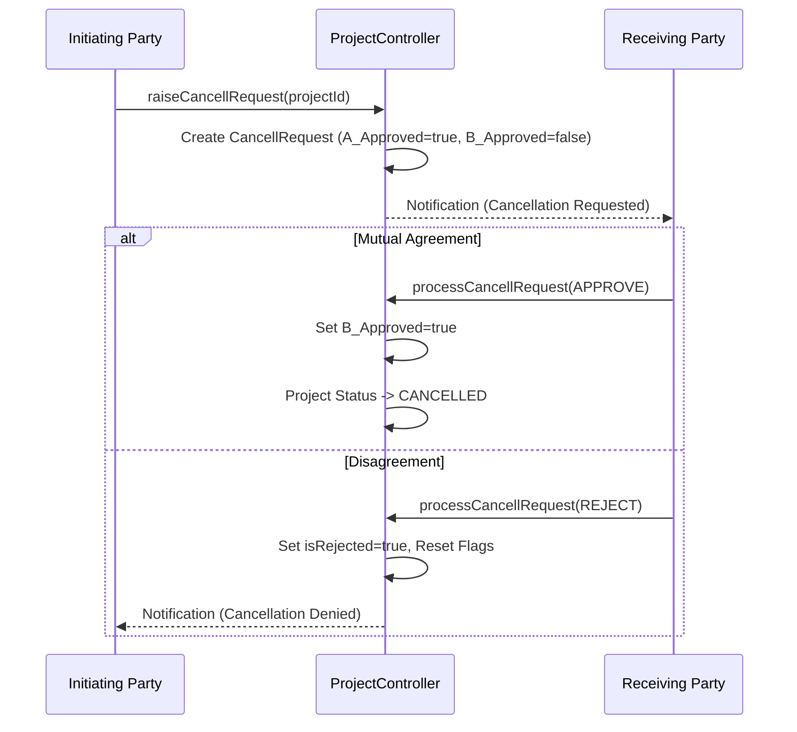

# Application Workflows

This document outlines the core end-to-end flows within MileGlide using Mermaid sequence diagrams.

## 1. User Registration Flow

## 2. Project Creation & Acceptance

## 3. Milestone Lifecycle

## 4. Payment Verification Flow

## 5. Mutual Cancellation Flow

